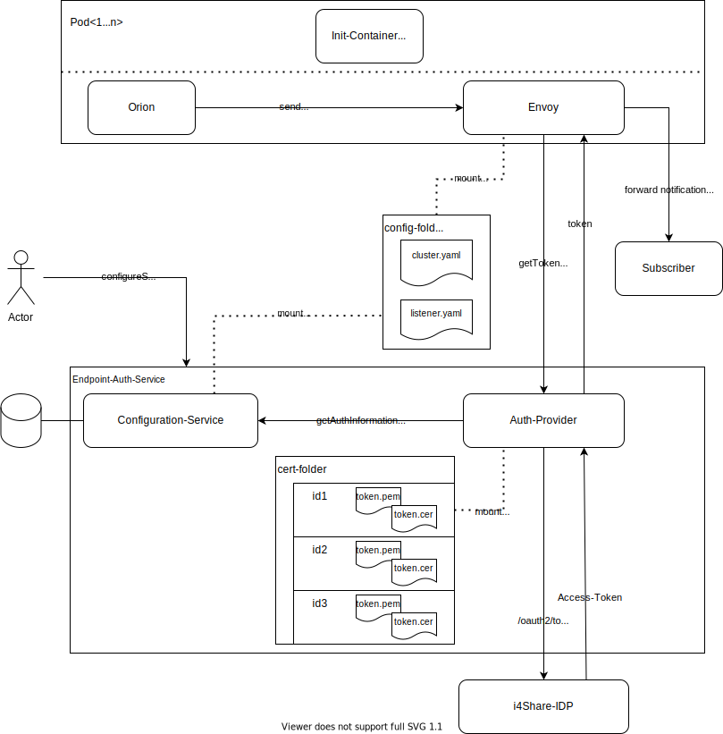

-------

# Endpoint-Auth-Service

In various use-cases, there is a need to apply authn/z to outgoing requests for components that do not handle this them-self(f.e. notifications in
[NGSI-LD brokers](https://github.com/FIWARE/context.Orion-LD)). This service provides that by adding an [envoy-proxy](https://www.envoyproxy.io) 
as [sidecar](https://www.oreilly.com/library/view/designing-distributed-systems/9781491983638/ch02.html) to the component that gets forwarded all 
outgoing requests via ip-tables(see [iptables-init](./src/iptables-init)). The sidecar-proxy does request auth-information at the [auth-provider](./src/auth-provider) 
and adds it to the requests accordingly. The endpoints to be handled and there auth-information can be configured through
[endpoint-configuration-service](./src/endpoint-configuration-service).

## Overview

The architecture consists of 2 main components:
- the sidecar-proxy to intercept and manipulate outgoing requests
- the endpoint-auth-service to provide configuration and authentication information

This architecture allows to separate the actual authentication flows from the proxy itself, thus giving more flexibility in terms of technology
and reduces the complexity of the lua-code inside the proxy. All lua-code placed there needs to be non-blocking to not kill the performance of the 
proxy(and therefore the proxied requests itself). Most auth-flows require contacting external services(f.e. the IDP in the iShare use-case) or some 
file-io(f.e. reading the certs in iShare), which is hard to implement in a non-blocking fashion. With using the built-in http-call method and moving 
the complexity into the domain of the auth-provider, this can be avoided. Besided that, it allows to use request-caching for thos calls to the auth-provider
in order to prevent a new auth-flow for every request.

## Run

To run the service locally, see [docker-compose](docker-compose/README.md)

## Testing

Unit-testing is dependent on the concrete component and described in the individual folders. See f.e. [iShare-auth-provider](src/ishare-auth-provider/README.md#Testing).
Integration-Testing is described in the [integration-test suite](integration-test/README.md).

## Development

For general development information, check the [contribution-guidelines](doc/CONTRIBUTING.md).
For information about the individual components, see their folders.

## Component specific documentation

* [envoy](doc/ENVOY.md)
* [auth-provider](doc/AUTHPROVIDER.md)
* [endpoint-configuration-servcie](src/endpoint-configuration-service/README.md)
* [iShare-auth-provider](src/ishare-auth-provider/README.md)
* [init-iptables](src/iptables-init/IPTABLES.md)

## ADRs

- [Add authentication via a sidecar-proxy](./doc/adr/sidecar-based-auth.md)
- [Use envoy as proxy](./doc/adr/choose-proxy.md)
- [Use mustache templating for envoy config](./doc/adr/mustache-templating.md)
- [Implement auth-providers as separate components](./doc/adr/authprovider-as-separate-component.md)
- [Auth-provider config on path level](./doc/adr/auth-provider-on-path-level.md)

## APIs

- [Endpoint-Configuration-API](./api/endpoint-configuration-api.yaml)
- [Auth-Provider-API](./api/auth-provider-api.yaml)
- [iShare-Credentials-Management-API](./api/ishare-credentials-management-api.yaml)

## Why not use mTLS?

mTLS is a method for mutual authentication. The parties on each end of the connection can be verified through TLS certificates. In contrast to that,
this solution targets the authentication-handling of only one side of the connection. The authentication of the connection-target is optionally available 
through https. 
In the general context of the endpoint-auth-service, participating in mTLS can be seen as an additional auth-method. In order to support that, the [lua-script in the listeners-template](src/endpoint-configuration-service/src/main/resources/templates/listener.yaml.mustache) 
would need to add the client-certificate to the request. Since the endpoint-auth-service uses [envoy](https://www.envoyproxy.io) and therefor can be integrated with a 
service-mesh like [istio](https://istio.io/), mTLS probably is easier to apply with the mesh.

As a conclusion, the endpoint-auth-service should not be seen as a competition or alternative to mTLS, but rather an option for supporting other and maybe additional
auth-methods, like the implemented [iShare-solution]().