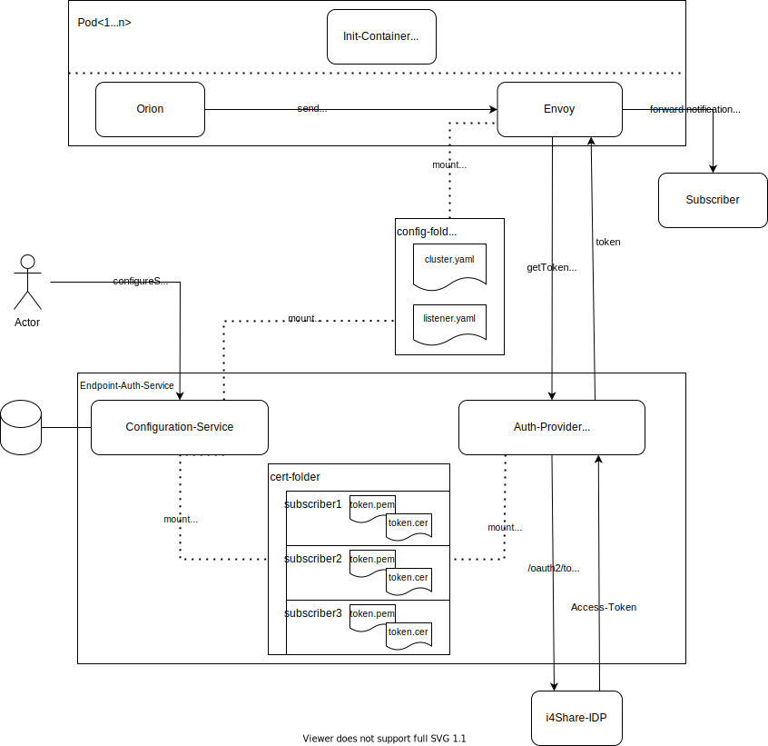

# Sidecar-Proxy for outgoing auth

## Overview

## ADRs

- [Add authentication via a sidecar-proxy](./adr/sidecar-based-auth.md)
- [Use envoy as proxy](./adr/choose-proxy.md)

## APIs

- [Configuration-API](../subscriber-config-api/api/api.yaml)