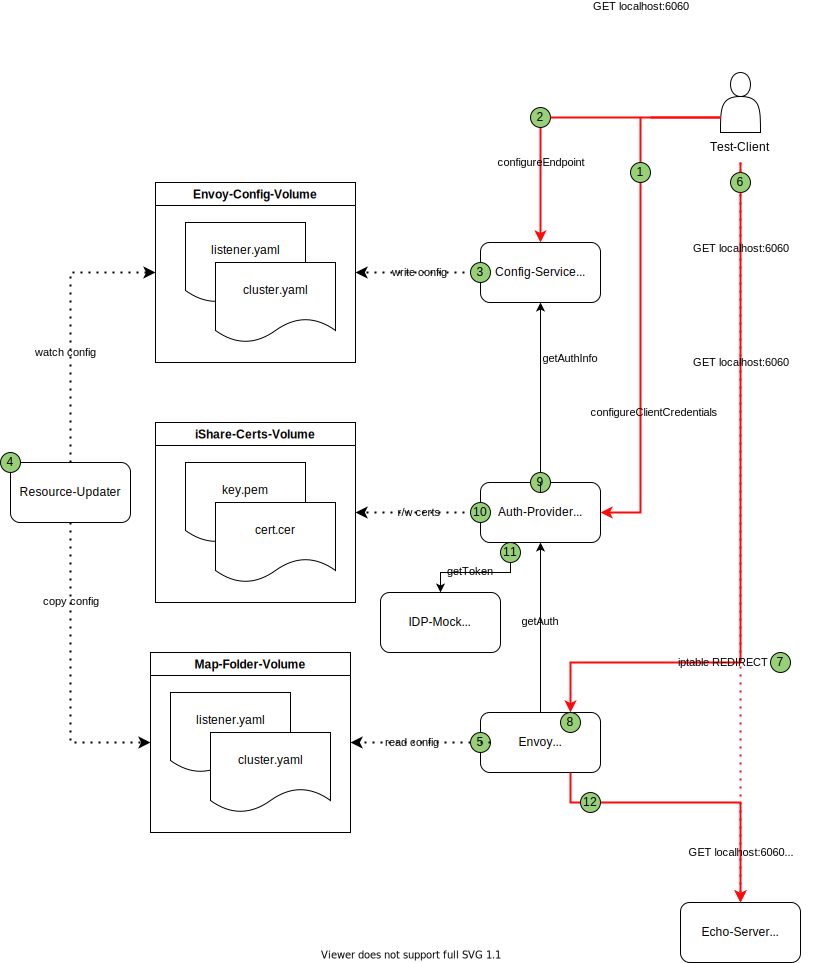

# Local setup

In order to run the whole service in a local environment, a docker-compose setup is provided. 

> :warning:  The dev setup relies on [iptable](https://linux.die.net/man/8/iptables) manipulation 
> in order to intercept requests and forward them to the proxy. If the OS does not support that, you 
> need to configure that individually.


## Setup



The development-setup runs on the host-network to allow the iptables-manipulations defined in [iptables.sh](./iptables.sh).
This script can be used to setup the iptables to redirect everything that is send to 6060 to 15001. That will redirect the traffic
to the echo-server to envoy. It also includes a rule to RETURN everything from the root-userspace, in order to jump out of envoy and
not potentially harm the whole host. If those configurations do not fit your needs, you need to setup up such behaviour differently
depending on your system.

> :warning:  Since the setup runs on host-network, the ports 1080,6060,7070 and 9090 are required. If they are not available, update the 
> [compose-file](./docker-compose.yaml) with working values.

The setup includes the following components:

### Helper

The setup relies on two helper components to bring up a working setup:

* IDP-Mock: a mockserver to play the role of an iShare-compliant IDP and answers every request to /oauth2/token with 
  ```200: {"access_token":"myIShareToken"}```
* Echo-Server: an endpoint to be requested from the client, that will echo each request made.

### Service-Components

* Envoy: the actual proxy component. Uses an init-script to copy initial config from [initial-config](./initial-config).
* Config-Service: the configuration service for envoy and the auth-provider. Uses an in-memory db(e.g. no persistence)
* Auth-Provider: auth-provider to be used by envoy. Needs to be configured(by the client through the config-service) for using the IDP-Mock.
* Resource-Updater: copies envoy-configuration from the volume used by the config-service to the volume used by envoy, in order to trigger envoy's [dynamic resource reloads.](https://www.envoyproxy.io/docs/envoy/latest/start/quick-start/configuration-dynamic-filesystem)

The components use volumes to share files(envoy-config, certificates) in a very similar manner as it happens inside a kubernetes-sidecar deployment.

## Execution

To start-up the environment run ```docker-compose up``` inside the [docker-compose folder](./). Then execute the [iptables.sh](./iptables.sh) to set up the port-redirection(needs to be run as root).

A request scenario will use the following path(numbers belong to the corresponding one in the diagram):

1. Client sends client credentials to the credentials-management api of the auth-provider: 
   ```
   curl --request POST 'localhost:7070/credentials/EU.EORI.CLIENTID' \
        --header 'Content-Type: application/json' \
        --data-raw '{
           "certificateChain": "<INSERT_CERTIFICATE>",
           "signingKey": "<INSERT_SIGNING_KEY>"
        }'
   ```
   The auth provider stores the credentials inside its own filesystem.


2. Client send configuration request to the config-service:
    ``` 
    curl --request POST 'localhost:9090/endpoint' \
    --header 'Content-Type: application/json' \
    --data-raw '{
      "domain": "localhost",
      "port": 6060,
      "path": "/",
      "useHttps": false,
      "authType": "iShare",
      "authCredentials": {
        "iShareClientId": "EU.EORI.CLIENTID",
        "iShareIdpId": "EU.EORI.IDPID",
        "iShareIdpAddress": "http://localhost:1080/oauth2/token",
        "requestGrantType": "client_credentials"
      }
    }' 
    ```


3.
   - Config-Service generates and writes listener.yaml and cluster.yaml to be used by envoy
   - Persists the configuration info inside H2
   - writes certificate and signing-key to be used by the auth-provider


4.
   - resource-updater receives write-event from the filesystem
   - resource-updater copies config to the envoy-config volume


5.
   - envoy notices move-event from the filesystem(triggered by the copy from the resource-updater)
   - envoy reloads cluster and listener configuration


6.
    Test-Client sends(unauthorized) request to the echo-server:```curl localhost:6060```


7.
    Iptables redirect port 6060 to (localhost)15001.


8.
    Envoy filter for domain "localhost" and path "/"(as configured in 1) matches and is handled by the [lua-filter](https://www.envoyproxy.io/docs/envoy/latest/configuration/http/http_filters/lua_filter).
    The filter sends a request to the auth-provider.


9.
    Auth-provider requests [auth-info](../api/endpoint-configuration-api.yaml#L120) from the config-service.


10.
    Auth-provider reads the certificate and signing-key from the folder received in the auth-info and generates an [iShare-JWT](https://dev.ishareworks.org/introduction/jwt.html)
    with it.


11.
    Auth-provider requests a token with the generated JWT. Will receive the "myIShareToken" mock-response and answer the token to envoy.


12.
    Envoy adds the received token to the request and forwards it to the echo-server at localhost:6060. The second [iptables-rule](./iptables.sh#8) makes 
    sure that the request does not get intercepted again.