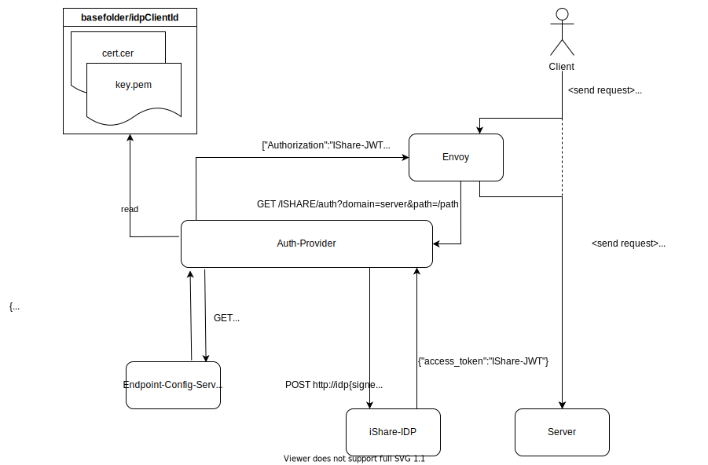
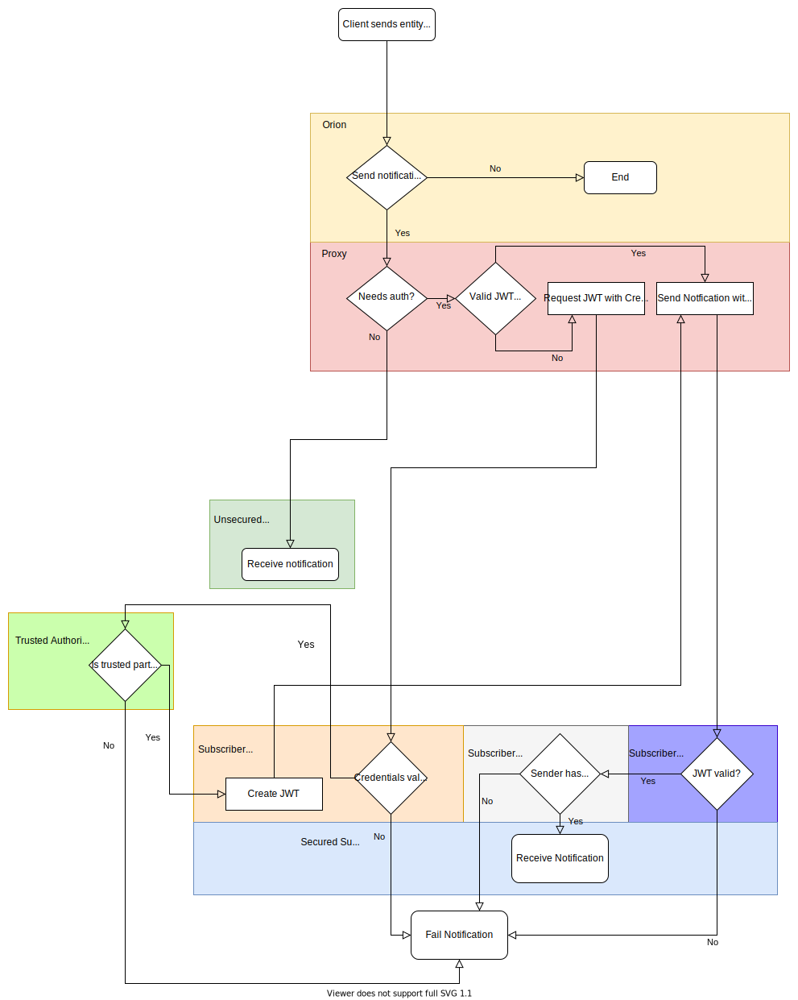

# iShare auth-provider

The iShare auth-provider is an [auth-provider](../../doc/AUTHPROVIDER.md) implementing the authentication mechanism defined by [iShare](https://dev.ishareworks.org/).
It handles all communication to the iShare identity-provider and returns an [Authorization-header](https://developer.mozilla.org/en-US/docs/Web/HTTP/Headers/Authorization) containing 
the retrieved JWT.

The provider offers an [api](../../api/ishare-credentials-management-api.yaml) for managing iShare related client-credentials. The credentials(a signing key in 
the [PKCS-8 format](https://en.wikipedia.org/wiki/PKCS_8) and the corresponding certificate) are stored per iShare-Client in the file-system of the auth-provider.
In order to retrieve all required information about the endpoint to authenticate to, the provider uses the [/auth-endpoint of the endpoint-configuration api](../../api/endpoint-configuration-api.yaml).
For a detailed view on the request flow of envoy and the auth-provider, take a look at the following diagram:




* envoy intercepts the request via [iptable-rule 2](../iptables-init/run.sh#4)
* envoy requests auth-headers from the provider
* iShare-auth-provider requests auth-information at the endpoint-configuration-service
* iShare-auth-provider reads key and cert from the idp-specific folder
* iShare-auth-provider generates a token from key and cert and requests the iShare-idp
* iShare-auth-provider responds the retrieved token as "Authorization"-header to envoy
* envoy adds the header to the request
* [iptable-rule 1](../iptables-init/run.sh#3) returns request to the server


## iShare notification flow

Detailed flow-chart for [NGSI-LD](https://www.etsi.org/deliver/etsi_gs/CIM/001_099/009/01.05.01_60/gs_CIM009v010501p.pdf) notfications in an iShare-Setup:



## Development

The auth-provider is implemented in [golang](https://go.dev/) and available as a [container at quay.io](https://quay.io/repository/wi_stefan/ishare-auth-provider)
It uses the [gin-framework](https://github.com/gin-gonic/gin) for serving the web-endpoints.

### Testing

> Precondition: for running the unit-test, go-v1.17.3 is required. See the official doc: https://go.dev/doc/install

To run the unit-tests: ```go test -v```
To run the unit-tests with coverage: ```go test -v -covermode=count -coverprofile=coverage.out``` - current reports can be viewed at [coveralls](https://coveralls.io/github/wistefan/endpoint-auth-service)
To run the integration-test, see [integration-test](../../integration-test/README.md)